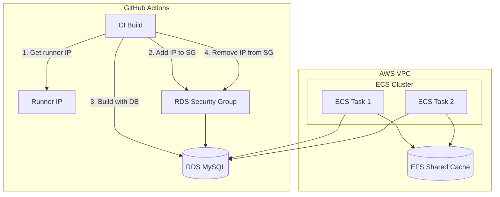

# SSG/ISR Full Route Caching Implementation

## Current State

- Next.js standalone output with 1GB cache
- SSG for 929 perek pages and 6 section pages
- `unstable_cache` with on-demand revalidation (`revalidate: false`)
- `/api/revalidate` endpoint exists for tag/path invalidation
- Docker build on GitHub Actions without DB access
- RDS is private (`PubliclyAccessible: false`)

## Architecture Overview




---

## Challenge 1: GitHub Runner to RDS Connection

**Chosen approach:** Dynamic IP whitelisting during build

### Implementation

1. **One-time AWS change:** Make RDS publicly accessible
  - AWS Console → RDS → Modify → Publicly accessible: Yes
  - This gives RDS a public DNS name (but still protected by security group)
2. **CI workflow changes** ([.github/workflows/shared-dockerize.yml](.github/workflows/shared-dockerize.yml)):

```yaml
- name: Configure AWS Credentials
  uses: aws-actions/configure-aws-credentials@v4
  with:
    role-to-assume: ${{ secrets.AWS_DEPLOY_ROLE_ARN }}
    aws-region: il-central-1

- name: Get runner public IP
  id: ip
  run: echo "ip=$(curl -s ifconfig.me)" >> $GITHUB_OUTPUT

- name: Whitelist runner IP in RDS security group
  run: |
    aws ec2 authorize-security-group-ingress \
      --group-id ${{ secrets.RDS_SECURITY_GROUP_ID }} \
      --protocol tcp --port 3306 \
      --cidr ${{ steps.ip.outputs.ip }}/32 \
      --tag-specifications 'ResourceType=security-group-rule,Tags=[{Key=Source,Value=github-actions-build}]'

- name: Build Docker with DB access
  uses: docker/build-push-action@v6
  with:
    build-args: |
      DB_URL=mysql://${{ secrets.RDS_USER }}:${{ secrets.RDS_PASSWORD }}@${{ secrets.RDS_HOST }}:3306/tanah

- name: Remove runner IP from security group
  if: always()
  run: |
    aws ec2 revoke-security-group-ingress \
      --group-id ${{ secrets.RDS_SECURITY_GROUP_ID }} \
      --protocol tcp --port 3306 \
      --cidr ${{ steps.ip.outputs.ip }}/32
```

1. **Dockerfile changes** ([web/bible-on-site/Dockerfile](web/bible-on-site/Dockerfile)):

```dockerfile
# In builder stage
ARG DB_URL
ENV DB_URL=$DB_URL

RUN npm run build
```

1. **Required GitHub Secrets:**
  - `RDS_SECURITY_GROUP_ID` - e.g., `sg-0abc123...`
  - `RDS_HOST` - public endpoint from RDS
  - `RDS_USER` - `admin`
  - `RDS_PASSWORD` - from Secrets Manager

---

## Challenge 2: Shared EFS Cache for Horizontal Scaling

### Infrastructure Setup

1. **Create EFS file system** ([docs/aws/cloudformation/efs-cache.yaml](docs/aws/cloudformation/efs-cache.yaml) - new file):

```yaml
Resources:
  NextJSCacheFileSystem:
    Type: AWS::EFS::FileSystem
    Properties:
      PerformanceMode: generalPurpose
      ThroughputMode: bursting
      Encrypted: true
      FileSystemTags:
        - Key: Name
          Value: bible-on-site-nextjs-cache

  # Mount targets in each subnet
  MountTargetA:
    Type: AWS::EFS::MountTarget
    Properties:
      FileSystemId: !Ref NextJSCacheFileSystem
      SubnetId: subnet-056e95f1b766e6b0d
      SecurityGroups:
        - !Ref EFSSecurityGroup
```

1. **Update ECS Task Definition** ([docs/aws/cloudformation/ecs-services.yaml](docs/aws/cloudformation/ecs-services.yaml)):

```yaml
WebsiteTaskDefinition:
  Properties:
    Volumes:
      - Name: nextjs-cache
        EFSVolumeConfiguration:
          FilesystemId: !Ref NextJSCacheFileSystem
          RootDirectory: /
          TransitEncryption: ENABLED
    ContainerDefinitions:
      - Name: website
        MountPoints:
          - SourceVolume: nextjs-cache
            ContainerPath: /app/.next/cache
            ReadOnly: false
```

1. **Next.js cache directory** - Already uses `/app/.next/cache` by default in standalone mode

### Cache Behavior with EFS

- All ECS tasks share the same `.next/cache` directory
- ISR revalidation on any task updates the shared cache
- New deployments may need cache warming or gradual rollout

---

## Challenge 3: Invalidation Routes

### Current Implementation

The `/api/revalidate` endpoint already exists at [web/bible-on-site/src/app/api/revalidate/route.ts](web/bible-on-site/src/app/api/revalidate/route.ts):

```typescript
// Supports both path and tag revalidation
POST /api/revalidate
Body: { secret, path?, tag? }
```

### With Shared EFS Cache

- **Single revalidation call updates all instances** - Since cache is shared via EFS
- No need for fan-out or multi-instance coordination
- Existing `/api/revalidate` endpoint works as-is

### Recommended Enhancements

1. **Add bulk revalidation endpoint** for multiple paths/tags:

```typescript
// POST /api/revalidate/bulk
{ secret, paths?: string[], tags?: string[] }
```

1. **Add webhook endpoint** for CMS/admin triggers:

```typescript
// POST /api/revalidate/webhook
// Validates signature, maps entity changes to cache tags
```

---

## Implementation Order

### Phase 1: GitHub to RDS Connection

1. Make RDS publicly accessible (AWS Console one-time change)
2. Add GitHub secrets: `RDS_SECURITY_GROUP_ID`, `RDS_HOST`, `RDS_USER`, `RDS_PASSWORD`
3. Update Dockerfile to accept `DB_URL` build arg
4. Update CI workflow with dynamic IP whitelisting
5. Test build with DB access

### Phase 2: EFS Setup

1. Create EFS file system and mount targets (CloudFormation or Console)
2. Create EFS security group (allow NFS port 2049 from ECS SG)
3. Update ECS task definition with EFS volume mount
4. Deploy and test shared cache behavior

### Phase 3: SSG/ISR Configuration

1. Revert `/authors` page from `force-dynamic` back to SSG
2. Verify `generateStaticParams` fetches from DB at build time
3. Test full build → deploy → revalidation flow

---

## Security Considerations

- Runner IP whitelisted only during build (~5 min window)
- IP removed immediately after build (even on failure via `if: always()`)
- RDS still protected by security group (no open access)
- EFS encryption at rest and in transit
- Revalidation endpoint protected by secret
- DB credentials passed as build arg (not stored in image)

## Cost Estimates

- EFS: ~$0.30/GB/month (cache typically < 1GB)
- RDS publicly accessible: No additional cost
- No bastion needed: Saves ~$7.50/month

