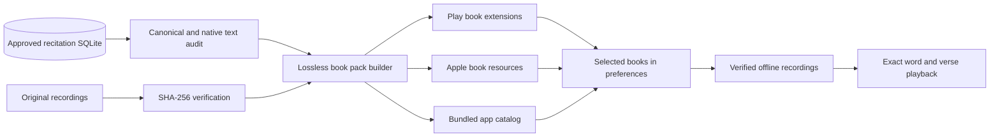

# Recitation extension delivery

Recitation is independent of the Perushim notes extension. Preferences lets readers
select whole books or all available books and shows each book's download size.
Android downloads `recitation_<seferId>` on-demand Play Asset Delivery modules.
iOS downloads the corresponding Apple On-Demand Resource tags through the same
delivery service used by Perushim. Playback never downloads an MP3 or catalog from
S3 or the website.

The catalog is bundled with the application. Its exact canonical words and approved
timings come from the durable recitation SQLite database, audited against the
canonical JSON and native Bible database. Held chapters have no word intervals;
they can play their full recording. Newly approved timings reach the app through
an app release, just like changes to the Perushim extension.

`prepare_recitation_assets.py --platform Android` (or `iOS`, `Windows`) creates
the release assets. `--recordings <directory>` uses the original local recordings;
otherwise **the build** fetches verified originals from the source URLs. Its hash
cache is resumable. ZIP packages store the original MP3 bytes without re-encoding,
and repeated generation produces identical archives. Native packaging invokes this
preparation automatically before evaluating the app project.

The app validates the archive hash and its complete inventory before importing
audio. Every recording must also match its original SHA-256 before an atomic
replacement. Completed recordings survive cancellation and app updates. Existing
downloads from the previous service are reused when their hashes still match.
After import, audio lives in persistent application storage and works offline;
the operating system may independently purge its temporary delivery cache.

Windows ships the same archives as application assets because the existing
delivery service has no Windows on-demand provider. Sideloaded Android Debug
builds also embed the archives for testing without Play. Mobile store Release
builds keep the audio out of the base installation.

CI generates real book packages, builds an Android release bundle, and checks
every module and archive hash. Store packaging also rejects an IPA without every
expected ODR tag and its compiled payload. Generated audio stays out of Git.

