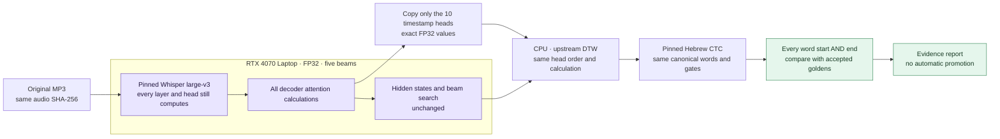
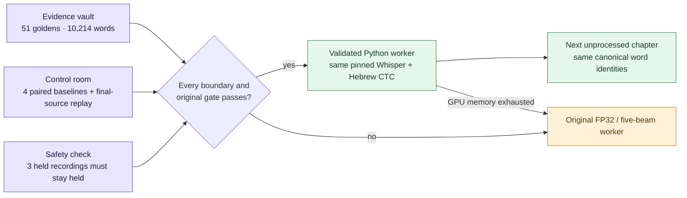

# Faster only when the boundaries survive

The production pipeline remains unchanged. Its recoverable baseline is the
pushed annotated tag `recitation-baseline-2026-10-07`, commit
`f600b484c65f7f3b13dee427cf19de52c58cdb8b`. That commit includes the complete
pipeline, model pins, accepted SQLite database and canonical JSON. A separate
worktree contains the experiments; they cannot publish timings.

## The experiment



`selected-heads` changes the saved diagnostic outputs after attention has already
produced its hidden states. The pinned model uses 10 cross-attention heads for
word timestamps, out of 32 layers × 20 heads. The experiment copies those exact
values to RAM, in the original selection order. Unused layers retain a cheap
shape-only view for upstream concatenation; they never enter DTW. Self-attention
diagnostics are also unused by timestamp extraction. No attention computation
is skipped and no numeric format changes.

`resident-self` leaves the decoder's self key/value cache on the GPU between
tokens; cross-attention cache still follows the original offload path. This
trades GPU headroom for fewer transfers. The combined profile tests both ideas.
An out-of-memory failure stops the experiment; it cannot change precision or
search settings to make a run fit.

These are hypotheses, not claimed speed improvements. Offloading is explicitly
a memory/speed tradeoff in the [Transformers cache documentation](https://huggingface.co/docs/transformers/kv_cache).
Asynchronous copies add synchronization requirements described in the
[PyTorch transfer tutorial](https://docs.pytorch.org/tutorials/intermediate/pinmem_nonblock.html);
this experiment instead keeps synchronous copies and reduces which outputs
need copying.

## Acceptance evidence

The immutable snapshot `benchmarks/golden-2026-10-07.json.gz` covers all **54 accepted
chapters and 10,370 word intervals**. It records the backup commit, original
pipeline source hashes, audio/text hashes, boundaries and truthful provenance.
Its content digest is pinned in the harness. The **51 current v3 references**
also include matching ASR and scored alignment evidence, revalidated against
the existing `trusted.py` gates while taking the snapshot.
Gzip reduces only the fixture's storage size; decompression restores its exact
JSON contents, and the comparison pins their content digest.

The three earlier listening/manual references, 568, 773 and 829, remain protected.
Their old pipeline metadata is preserved and clearly excluded from the pinned
v3 experiment; they cannot silently become automatic approvals.

Every tested chapter must meet all of these requirements:

- Same original recording, canonical words, identity, order and word count.
- Full pinned models, FP32, five beams, native long-form decoding and unchanged
  coverage, text and acoustic thresholds.
- Original acceptance gates pass; diagnostic warnings and scores remain visible.
- Each word's start **and** end differs by at most **5 ms**, including verse
  boundaries. One 6 ms outlier fails even if the average is nearly zero.
- Recognized ASR word count/text remains identical and each ASR boundary stays
  within 5 ms. Text scores remain identical. Following the owner's clarification
  on 2026-10-07, acoustic scores may vary by at most **0.001 per word** (0.1
  percentage point), checked individually rather than averaged. The original
  acoustic acceptance threshold and warning policy remain unchanged. These
  scores are uncalibrated evidence, not an estimate of audible quality.
- A fresh baseline replay reproduces the golden reference before a paired
  runtime comparison can support a speed claim.

The harness reports missing chapters, every failing boundary, runtime for ASR
and CTC, peak CUDA allocation and the software/GPU environment. New runs also
separate model loading from inference so warm file caches cannot masquerade as
an inference speedup. A subset is
explicitly incomplete. `promotionAllowed` is always false: full golden coverage,
held-case controls and review are required before a separate production change.
Unit tests establish exact tokens, timestamps and selected attention values on
a small random model, on CPU and explicitly enabled CUDA. They do not substitute
for real recordings.

## Run without disturbing the collection worker

Use the existing CUDA venv and HF cache. Do not run alongside `recite.py` or
another GPU benchmark. The runner checks actual Windows processes and uses an
atomic lease; after a crash inspect the recorded PID before removing a stale
lease. Windows stays awake only for the process lifetime.

From `data/recitation`, with the existing venv's Python executable:

```powershell
# Default profile is the preserved baseline. No ASR reference cache is reused.
python benchmark.py run --goldens benchmarks/golden-2026-10-07.json.gz `
  --recordings C:/Users/Dorad/git/tanah-s3/recordings `
  --output .outputs/benchmarks/smoke --perek 338 `
  --profiles baseline selected-heads selected-heads-resident-self

# Omitting --perek selects every eligible golden reference, shortest first.
# Repeating the exact run resumes only completed, matching isolated results.
# --baseline-perek selects fresh baseline controls without rerunning all 51
# baseline transcriptions. Candidate coverage and missing controls stay explicit.
```

Results go into the specified experiment directory, never into the collection's
ASR cache, checkpoint database, accepted database or canonical text. A source,
runner, software-environment or profile change rejects stale resume results.
The original `recite.py` remains the recovery path and imports no experiment.

## Measured results

The first GPU smoke test on Isaiah 4 (338, 89 words) produced these results:

| Profile | ASR seconds | Total seconds | Worst boundary drift | Peak CUDA allocation |
| --- | ---: | ---: | ---: | ---: |
| Preserved baseline | 356.390 | 361.765 | 0 ms | 6.27 GiB |
| Selected timestamp heads | 345.657 | 349.907 | 0 ms | 6.27 GiB |
| Selected heads + resident self cache | 336.796 | 340.937 | 0 ms | 6.29 GiB |

ASR evidence is exactly identical. Both pass the original quality gates. The
selected-head run took 3.3% less total time in this single pair, including model
loading and CTC. This is preliminary: the baseline ran first, and an independent
CPU diagnostic ran during part of the candidate. More recordings and repeated
controls are needed before making a collection-wide speed claim. The combined
profile took 5.8% less total time (1.061× throughput) in this first pair and used
about 21 MiB more peak CUDA allocation. Its ASR and all 89 scored word rows are
also exactly identical to the contemporaneous baseline.

Both CUDA runs differ from the stored acoustic scores by at most 0.0005, with
zero boundary changes. A separate pinned CPU CTC replay reproduces all stored
scores and boundaries exactly. This identifies a CPU/CUDA comparison effect,
rather than an effect introduced by retaining fewer attention maps; the two
CUDA runs also retain identical acoustic evidence. PyTorch documents that
[CPU and GPU results need not be identical](https://docs.pytorch.org/docs/2.14/notes/randomness.html).
The original stricter comparison recorded that score difference as a failure;
the evidence is preserved, and the later user-approved 0.001 tolerance is explicit.

The smoke test completed successfully under the explicit 0.001 score tolerance;
the original strict-score reports are retained as evidence of the comparison
change. Small-model checks pass for all profiles on CPU and CUDA, with exact tokens, timestamps and selected
attention maps. Full golden coverage and held-case controls remain required;
no production profile has changed.

## Moving the measured gain into the queue

The four contemporaneous baseline controls show about **8.3% less inference
time** for the combined profile. Comparing chapters per hour alone exaggerates
the gain: these golden chapters are short. The full suite is still accumulating
evidence; a partial result cannot activate the queue.

`validated_worker.py` wraps the original worker without editing `recite.py`,
`whisper_memory.py`, model pins or acceptance gates. Its default is the original
path. The faster profile requires all 51 golden chapters, all four fresh
baseline controls, a fresh baseline/candidate pair from the final reviewed
source, and fresh negative controls from three genuinely held recordings.
The wrapper recomputes comparisons and rechecks original acceptance evidence;
it does not trust a summary's success flag.



The immutable negative fixture preserves the original missing boundaries,
diagnostics and rejection reasons for chapters 102, 783 and 765. Its fresh
replays are diagnostic only. A missing interval becoming filled, changed ASR
text, excessive boundary/score drift, or an unexpected approval fails the
negative check. Those results never enter the publication database.

The queue records the qualification and actual ASR path in manifest, diagnostic
report and database provenance. Reused ASR records are labelled as verified
caches, with their original execution profile left unknown when unavailable.
A CUDA out-of-memory error retries the original FP32, five-beam whole-track
inference with the same arguments; driver failures propagate. No smaller model,
precision change or automatic timestamp repair is used for recovery.

From the repository root, using the existing CUDA venv and HF cache, after the
exclusive full suite has exited:

```powershell
python data/recitation/held_controls.py `
  --recordings C:/Users/Dorad/git/tanah-s3/recordings `
  --output data/recitation/.outputs/benchmarks/held-controls

python data/recitation/validated_worker.py `
  --memory-profile selected-heads-resident-self `
  --validation data/recitation/.outputs/benchmarks/golden-suite-2026-10-07 `
  --final-control data/recitation/.outputs/benchmarks/final-source-338-2026-10-07 `
  --held-controls data/recitation/.outputs/benchmarks/held-controls `
  --recordings C:/Users/Dorad/git/tanah-s3/recordings `
  --shortest-first --database path/to/working.sqlite --text path/to/working.json
```

Add `--check-only` to verify qualification without starting inference. Missing,
stale or failed evidence refuses the faster path. Preserve the existing working
cache/output directories when resuming a collection. The original command
remains the fallback and the timing publication cadence is unchanged.
