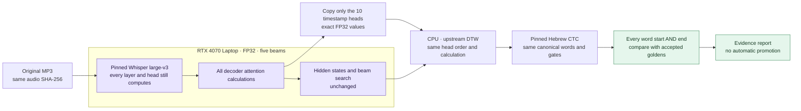

# Faster only when the boundaries survive

The production pipeline remains unchanged. Its recoverable baseline is the
pushed annotated tag `recitation-baseline-2026-10-07`, commit
`f600b484c65f7f3b13dee427cf19de52c58cdb8b`. That commit includes the complete
pipeline, model pins, accepted SQLite database and canonical JSON. A separate
worktree contains the experiments; they cannot publish timings.

## The experiment



`selected-heads` changes the saved diagnostic outputs after attention has already
produced its hidden states. The pinned model uses 10 cross-attention heads for
word timestamps, out of 32 layers × 20 heads. The experiment copies those exact
values to RAM, in the original selection order. Unused layers retain a cheap
shape-only view for upstream concatenation; they never enter DTW. Self-attention
diagnostics are also unused by timestamp extraction. No attention computation
is skipped and no numeric format changes.

`resident-self` leaves the decoder's self key/value cache on the GPU between
tokens; cross-attention cache still follows the original offload path. This
trades GPU headroom for fewer transfers. The combined profile tests both ideas.
An out-of-memory failure stops the experiment; it cannot change precision or
search settings to make a run fit.

These are hypotheses, not claimed speed improvements. Offloading is explicitly
a memory/speed tradeoff in the [Transformers cache documentation](https://huggingface.co/docs/transformers/kv_cache).
Asynchronous copies add synchronization requirements described in the
[PyTorch transfer tutorial](https://docs.pytorch.org/tutorials/intermediate/pinmem_nonblock.html);
this experiment instead keeps synchronous copies and reduces which outputs
need copying.

## Acceptance evidence

The immutable snapshot `benchmarks/golden-2026-10-07.json.gz` covers all **54 accepted
chapters and 10,370 word intervals**. It records the backup commit, original
pipeline source hashes, audio/text hashes, boundaries and truthful provenance.
Its content digest is pinned in the harness. The **51 current v3 references**
also include matching ASR and scored alignment evidence, revalidated against
the existing `trusted.py` gates while taking the snapshot.
Gzip reduces only the fixture's storage size; decompression restores its exact
JSON contents, and the comparison pins their content digest.

The three earlier listening/manual references, 568, 773 and 829, remain protected.
Their old pipeline metadata is preserved and clearly excluded from the pinned
v3 experiment; they cannot silently become automatic approvals.

Every tested chapter must meet all of these requirements:

- Same original recording, canonical words, identity, order and word count.
- Full pinned models, FP32, five beams, native long-form decoding and unchanged
  coverage, text and acoustic thresholds.
- Original acceptance gates pass; diagnostic warnings and scores remain visible.
- Each word's start **and** end differs by at most **5 ms**, including verse
  boundaries. One 6 ms outlier fails even if the average is nearly zero.
- Recognized ASR word count/text remains identical and each ASR boundary stays
  within 5 ms. Rounded acoustic/text evidence must also remain identical.
- A fresh baseline replay reproduces the golden reference before a paired
  runtime comparison can support a speed claim.

The harness reports missing chapters, every failing boundary, runtime for ASR
and CTC, peak CUDA allocation and the software/GPU environment. A subset is
explicitly incomplete. `promotionAllowed` is always false: full golden coverage,
held-case controls and review are required before a separate production change.
Unit tests establish exact tokens, timestamps and selected attention values on
a small random model, on CPU and explicitly enabled CUDA. They do not substitute
for real recordings.

## Run without disturbing the collection worker

Use the existing CUDA venv and HF cache. Do not run alongside `recite.py` or
another GPU benchmark. The runner checks actual Windows processes and uses an
atomic lease; after a crash inspect the recorded PID before removing a stale
lease. Windows stays awake only for the process lifetime.

From `data/recitation`, with the existing venv's Python executable:

```powershell
# Default profile is the preserved baseline. No ASR reference cache is reused.
python benchmark.py run --goldens benchmarks/golden-2026-10-07.json.gz `
  --recordings C:/Users/Dorad/git/tanah-s3/recordings `
  --output .outputs/benchmarks/smoke --perek 338 `
  --profiles baseline selected-heads selected-heads-resident-self

# Omitting --perek selects every eligible golden reference, shortest first.
# Repeating the exact run resumes only completed, matching isolated results.
```

Results go into the specified experiment directory, never into the collection's
ASR cache, checkpoint database, accepted database or canonical text. A source,
runner, software-environment or profile change rejects stale resume results.
The original `recite.py` remains the recovery path and imports no experiment.

## Measured results

Real-recording GPU measurements are in progress. No velocity improvement has
been established yet. The initial small-model numerical checks pass for all
profiles on both CPU and CUDA, with exact tokens, token timestamps and selected
attention maps. Full golden comparisons remain required.
