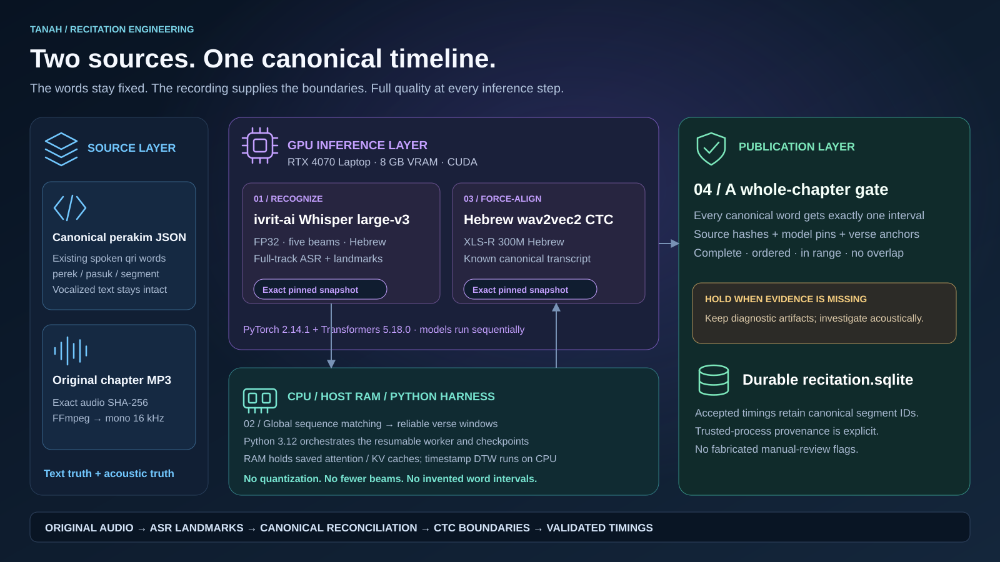
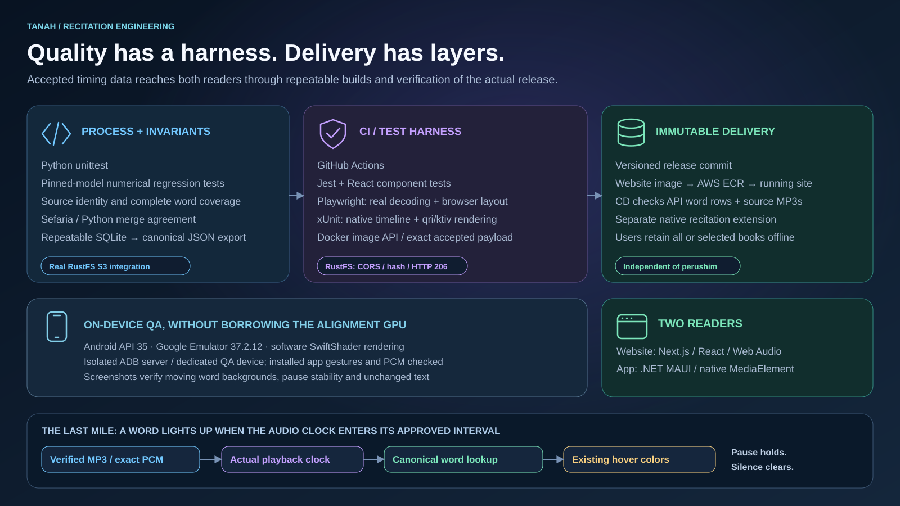
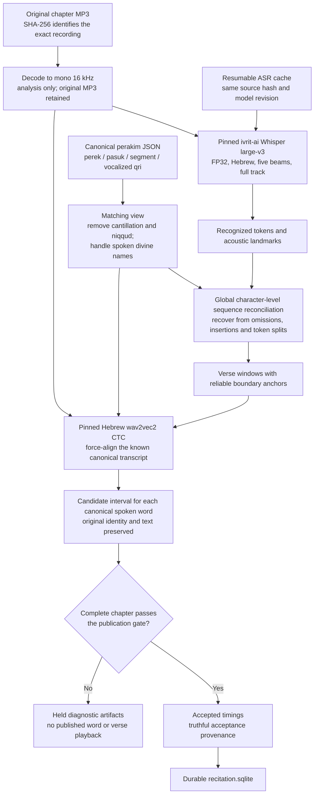
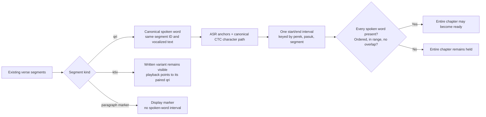
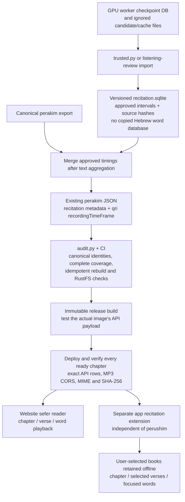
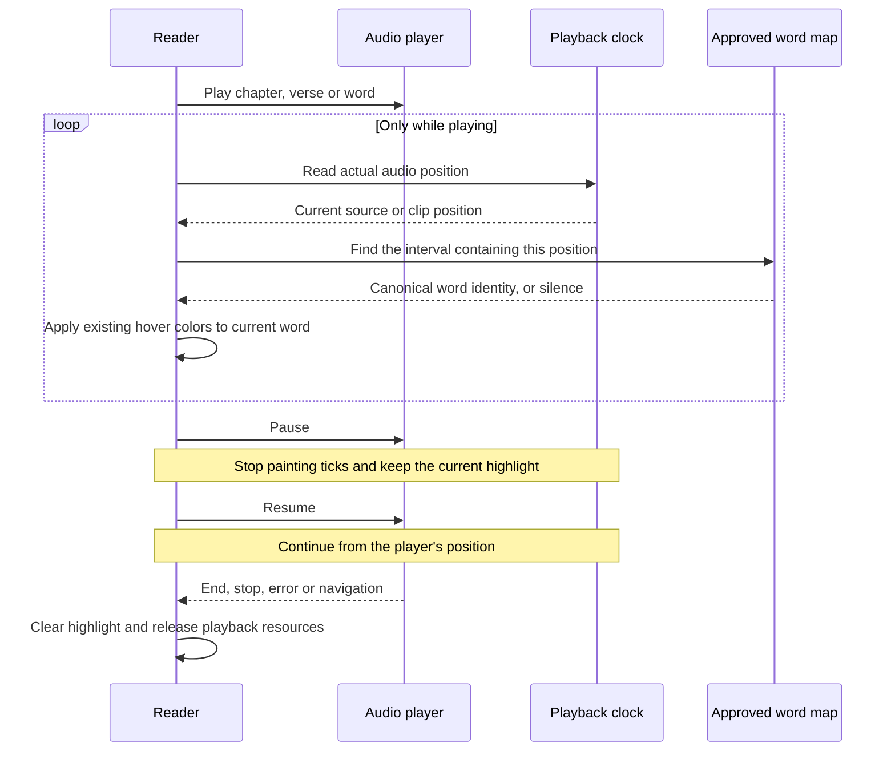

# How recitation segmentation works

The canonical perakim JSON decides **which words exist**. The recording decides
**when they are spoken**. Whisper helps locate the verses; Hebrew forced alignment
finds the boundaries of the already known words. Neither model rewrites the Bible.

This guide describes the implemented version 3 process. See the
[runbook](README.md) for installation, commands, review and storage checks.

## The stack at a glance

These 16:9 vector diagrams can be used directly in presentations. The GPU model,
software versions, offloading strategy and test harness describe the actual
implementation and validated local setup. Model stages run sequentially on the
same GPU; the layout does not imply concurrent inference.

[Open the segmentation stack at full size](diagrams/segmentation-stack.svg).

[Open the delivery and test harness at full size](diagrams/delivery-harness.svg).

## From two sources to one timing per word

The cache is reused only when the recording and pinned ASR model match. It avoids
repeating identical inference; it does not substitute a smaller model or shorter
audio. `whisper_memory.py` moves retained attention/cache tensors between GPU and
RAM while preserving full FP32 inference and five beams.

Sequence reconciliation uses dynamic programming and character edit similarity,
rather than semantic embeddings or two greedy pointers. A local spelling or
tokenization error must not shift all later words. Internal one-to-two or
two-to-one ASR matches are evidence for locating the transcript: the output still
contains exactly one row per canonical spoken segment.

The forced aligner receives the **canonical transcript**, not Whisper's spelling.
Its CTC path accounts for every transcript character and requires blank states
between repeated characters. Overlapping verse windows are aligned jointly within
the existing 45-second acoustic limit. An unresolved overlap holds the chapter.
Analysis-window context is not padding added to a published word interval.

## What “one to one” means

Markup is parsed into text before matching where required. Normalization changes
only a comparison view. It never changes the stored Hebrew, segment IDs, maqaf,
qri/ktiv relationships, or the canonical word count.

`trusted.py` independently checks the current artifacts against the original MP3
and canonical JSON. The version 3 gate requires:

| Evidence | Requirement |
| --- | --- |
| Identity | Exact audio SHA-256, canonical word/text SHA-256, pinned model revisions and process settings |
| Verse landmarks | At least 85% ASR anchor coverage at text similarity 0.6 or higher, including both first and last words |
| Word intervals | Complete canonical coverage; finite, ordered, nonoverlapping timestamps within the recording |
| Word duration | 40–3000 ms per word |
| Diagnostics | Matching ASR cache and candidate artifacts; no missing intervals, unresolved overlaps, unknown warnings or other failures |
| Provenance | Either actual listening-review acceptance or versioned `trusted-process` acceptance |

The acoustic score threshold of 0.5 generates diagnostic warnings. These scores
are uncalibrated CTC likelihoods, **not probabilities that a boundary is correct**.
The trusted gate permits low-acoustic-score warnings alone when every other
requirement passes, preserving each score and warning. It does not quietly lower
thresholds or pretend that each accepted chapter was manually heard. Automatic
acceptance never invents word-level `reviewed` flags.

Missing anchors or intervals are investigated acoustically using the same pinned
models. Padding, clamping or filling gaps with guessed timestamps is not an
acceptance path. Previously approved chapters survive unapproved reruns.

## Storage and delivery

The intermediate SQLite database is durable publication input. The running
worker's working JSON can intentionally lag its checkpoint DB; it is not the
publication source. Only complete artifacts validated in the current acceptance
run are overlaid into the durable database.

The Sefaria export merges this database **after canonical text aggregation**, so
rerunning that pipeline cannot silently erase accepted timings. `publish.py`
provides the same merge for an existing JSON export. Both implementations share
the schema and canonical hash contract, reject stale identities, and preserve
the same intervals on repeated runs. Word timings use the existing qri
`recordingTimeFrame.from/to` fields; there is no public sidecar word database.

CI/CD does not need Whisper, model weights or a GPU. It consumes accepted data,
tests the actual packaged API and verifies the running release and source audio.
S3 and the local RustFS mock use the same original MP3 object layout and public
read/CORS behavior. Chapters awaiting segmentation can offer full-chapter audio;
they cannot claim word or verse timings.

## Playback precision and the moving highlight

The website verifies and fully decodes the original MP3 once, then schedules
approved offsets and durations on an `AudioBufferSourceNode`. Aligned chapter
playback uses that same gapless buffer and AudioContext clock. Unaligned chapters
use the same engine for the full recording, so speed and gain controls work
consistently, including on iOS browsers. This avoids the imprecise MP3 seek path found during the pilot;
the original timing values are unchanged.

The app plays precise word/verse clips as decoded PCM and reads the native
player's clock. For multiple selected verses, `RecitationTimeline` maps each
original interval into the joined clip's position, preserving gaps within a
verse and the original canonical identities. The main reader and focused verse
both highlight the spoken qri, including qri variants.

Painting uses browser animation frames or a 25 ms native UI tick. These schedule
display updates, not audio cuts or inferred timing. Silence has no active word;
pause holds the current highlight; completion, errors and navigation clear it.
Only foreground/background colors change, without adding text or changing fonts
and spacing.

## Where to look in the code

| Responsibility | Implementation |
| --- | --- |
| Pinned model snapshots | [model_versions.py](model_versions.py) |
| Worker, resumable cache, verse windows | [recite.py](recite.py), [whisper_memory.py](whisper_memory.py) |
| Canonical identities and sequence reconciliation | [alignment.py](alignment.py) |
| Hebrew CTC path and acoustic boundaries | [acoustic.py](acoustic.py) |
| Trusted acceptance and provenance | [trusted.py](trusted.py) |
| Durable merge and invariant audit | [publish.py](publish.py), [audit.py](audit.py) |
| Packaged and deployed API/audio verification | [deployment.py](deployment.py) |
| Website playback clock and word lookup | [recitation-audio.ts](../../web/bible-on-site/src/lib/recitation-audio.ts), [recitation.ts](../../web/bible-on-site/src/lib/recitation.ts) |
| Native clip timeline and reader | [RecitationTimeline.cs](../../app/BibleOnSite/Helpers/RecitationTimeline.cs), [PerekPage.Recitation.cs](../../app/BibleOnSite/Pages/PerekPage.Recitation.cs) |
| Native extension and verified audio | [RecitationService.cs](../../app/BibleOnSite/Services/RecitationService.cs) |

## Reader settings and verse playlists

The website keeps display and narration preferences in one settings dropdown. Horizontal spacing changes the gap between words without changing letters or niqqud. Font size and vertical spacing retain the reader's existing choices. The chapter shortcut opens the same dropdown directly at narration settings. The native app exposes narration controls only while its independent recitation extension is enabled.

Speed and volume apply to both full recordings and precise clips. Original recorded pauses remain the default. A custom pause is available only for chapters with approved verse boundaries: the website schedules the original PCM verse ranges on the Web Audio clock, and the app joins the same decoded ranges into a WAV with explicit silence between verses. The silence is a playback preference; published word intervals and audio hashes stay unchanged. Custom pause lengths are wall-clock durations, including at non-default playback speeds.

Word highlighting maps playback back to the canonical recording timeline. It clears during custom silence, survives pause/resume, and continues from the original source position after a website speed change. Opening settings does not stop playback. Custom verse-pause changes apply the next time a chapter is played.
