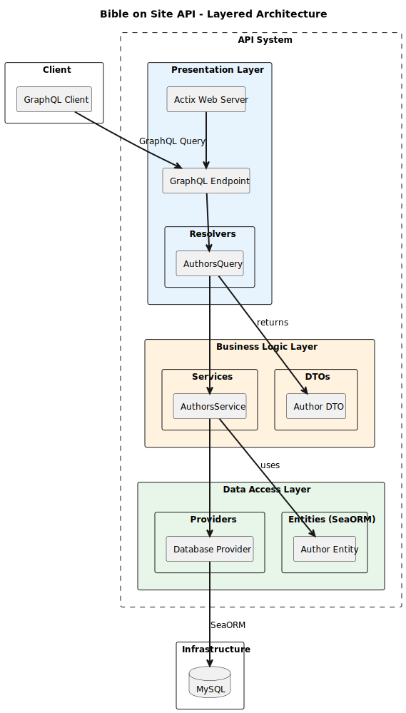

# API Architecture

This document describes the architecture of the Bible on Site API.

## Architecture Diagram

## Layers

### Presentation Layer
- **Actix Web Server**: HTTP server framework for Rust
- **GraphQL Endpoint**: Single endpoint for all GraphQL queries
- **Resolvers**: Handle incoming GraphQL queries and delegate to services

### Business Logic Layer
- **Services**: Business logic and data orchestration
- **DTOs**: Data Transfer Objects for API responses

### Data Access Layer
- **Providers**: Database connection management
- **Entities (SeaORM)**: ORM models mapped to database tables

## External Dependencies

- **Client**: Any GraphQL client consuming the API
- **MySQL**: Relational database for persistent storage
