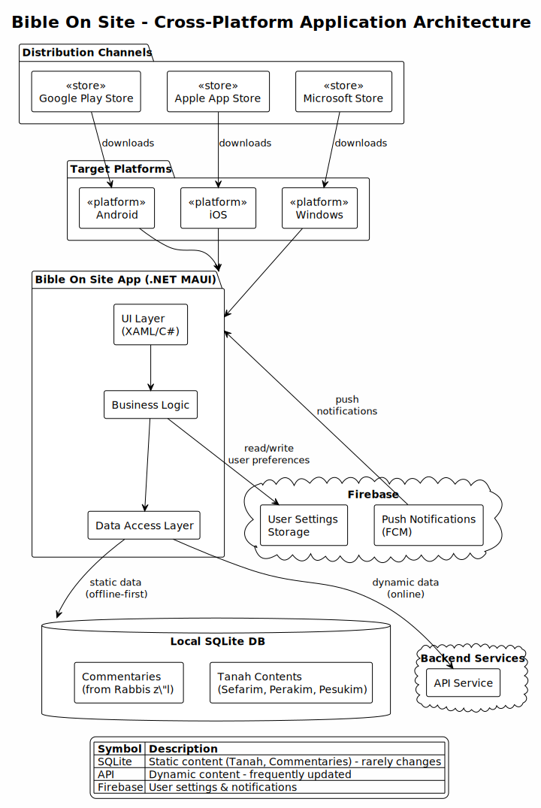

# Bible On Site - Mobile & Desktop Application

## Overview

Bible On Site is a cross-platform application available on **Android**, **iOS**, and **Windows**. Users can download the app from their respective platform stores:

- **Google Play Store** (Android)
- **Apple App Store** (iOS)
- **Microsoft Store** (Windows)

## High Level Architecture



## Technology Evolution

The application has evolved through multiple technology stacks:

| Generation | Technology | Notes |
|------------|------------|-------|
| 1st | Cordova | Cross-platform hybrid |
| 2nd | Cordova / Swift | Hybrid with native iOS |
| 3rd | Flutter | Cross-platform with Dart |
| 4th (current) | .NET MAUI | Cross-platform with C#/XAML |

### Data Sources

The app uses a hybrid data strategy:

1. **Local SQLite Database** - Stores static content that rarely changes:
   - Tanah contents (Sefarim, Perakim, Pesukim)
   - Commentaries from Rabbis z"l (of blessed memory)

2. **API Service** - Provides dynamic content that updates frequently

### Firebase Integration

The app integrates with Firebase for:

- **User Settings Storage** - Persisting user preferences across devices
- **Push Notifications** - Delivering updates and reminders via Firebase Cloud Messaging (FCM)

## Development

### Prerequisites

- .NET 9.0 SDK
- MAUI workloads: `dotnet workload install maui`

### Build System

The app uses [NUKE](https://nuke.build/) for build automation (similar to cargo-make for Rust).

```bash
cd app
dotnet tool restore              # First time only
dotnet run --project devops -- [target]
```

### Available Targets

| Target | Description |
|--------|-------------|
| `Compile` | Build all projects (default) |
| `Clean` | Clean build outputs |
| `Restore` | Restore NuGet packages |
| `Test` | Run all tests (unit + integration) |
| `TestUnit` | Run unit tests only |
| `TestIntegration` | Run integration tests (requires API) |
| `RunWindows` | Run app on Windows |
| `RunAndroid` | Run app on Android emulator |
| `RunIos` | Run app on iOS simulator |
| `RunMac` | Run app on Mac Catalyst |

### Examples

```bash
dotnet run --project devops -- Compile        # Build the app
dotnet run --project devops -- Test           # Run all tests
dotnet run --project devops -- RunWindows     # Launch on Windows
dotnet run --project devops -- --help         # Show all targets
```

## Deployment

The app is deployed via GitHub Actions CD workflow (`cd-app.yml`).

### Store Limits & Cleanup

| Store | Testing Channel | Hard Limit | Cleanup Strategy |
|-------|-----------------|------------|------------------|
| **Microsoft Store** | Package Flights | **25 flights max** | Auto-cleanup keeps 15 most recent |
| **Google Play** | Internal Track | No known limit | N/A |
| **Apple TestFlight** | External Beta | 90-day build expiration | Auto-expires |

> ⚠️ **Microsoft Store Flight Limit**: Partner Center enforces a hard limit of 25 package flights per app. The CD workflow automatically deletes old flights before creating new ones to stay under this limit.
