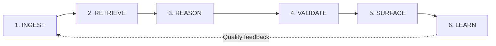
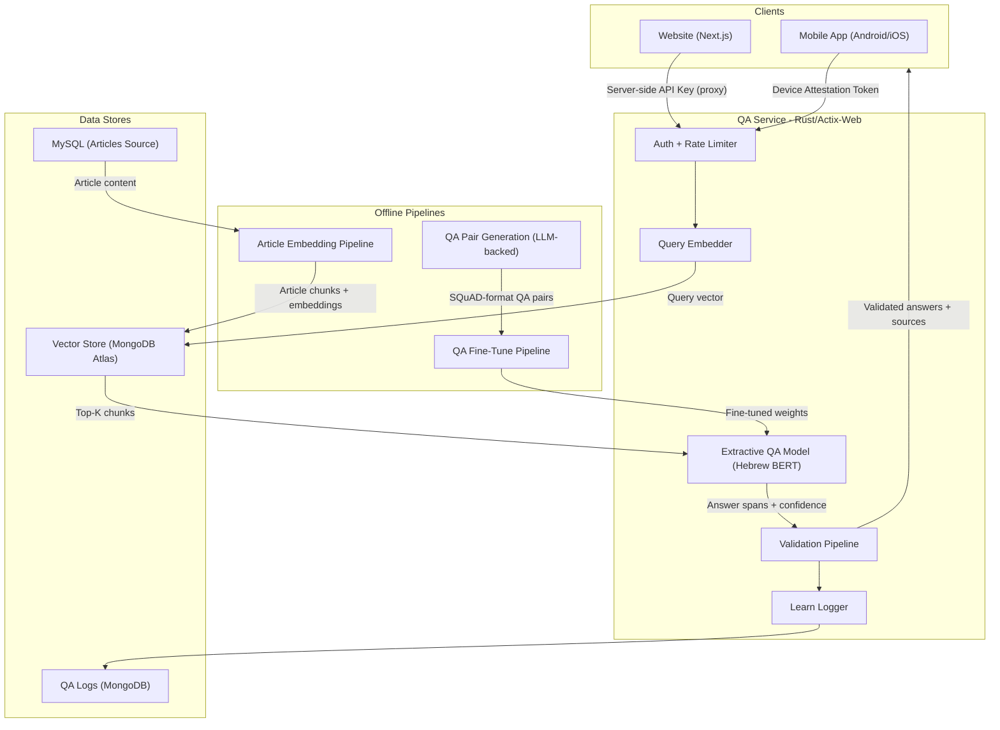

# בוט על הפרק — Tanah QA System Integration Plan

Extractive QA over articles and perushim, no pre-information, full Ingest–Retrieve–Reason–Validate–Surface–Learn pipeline. BEREL for MVP; ParshanBERT as tech debt / future replacement.

---

## Problem Restatement & Scope

**Inputs:** User question (natural language, Hebrew); optional scope filter (e.g. `perekId`).

**Outputs:** Ranked list of answer spans with citations (verbatim from ingested articles/perushim), or a clear “no confident answer” signal. Each answer includes source (type, name, author, perek), confidence, and surrounding context.

**Constraints:** Answers must be extractive only (no generative LLM) so that “no pre-information” is enforced by architecture. Religious-text use case favors exact quotes and citations over paraphrasing.

**Out of scope for MVP:** Generative summarization, multi-turn chat, Windows/Mac app attestation, ParshanBERT replacement.

---

## Design Framework

Following the **Ingest → Retrieve → Reason → Validate → Surface → Learn** loop (LLM/system-design framework: end-to-end from ingestion to output validation, with explicit validation and learning).



## High-Level Architecture



---

## 1. Why Extractive QA (Not Generative LLM)

**Problem with generative LLMs (GPT-4o, Claude, etc.):** They are trained on vast internet data including Sefaria, Wikipedia, and Jewish texts. Even with strict system prompts, they leak pre-trained Tanah knowledge into answers. Prompt-based "no pre-information" constraints are unreliable.

**Extractive QA solves this at the architecture level:**

- Given a context passage and a question, the model outputs **start/end positions** of the answer span **within the provided text**
- It is structurally incapable of generating from pre-training -- it can only point to text in the input
- "No pre-information" is guaranteed by design, not by prompting

**Trade-off:** Answers are verbatim quotes from sources (not synthesized). For a religious text application this is a *feature* -- users get exact source quotes with citations, which is more trustworthy than AI paraphrasing.

---

## 2. QA Service (`web/qa-service/`)

### Model creation (Hugging Face) vs deployment (Rust)

**Model creation:** Hugging Face (Python) only — fine-tune BEREL / train ParshanBERT, QA pair pipeline, evaluation, export to ONNX. No Python in production.

**Deployment:** Rust service loads the exported ONNX model and tokenizer from disk (baked into the image) and runs inference in-process (CPU) via ONNX Runtime. One binary, one container.

**Rust inference (ONNX + ort):** We use **ONNX + ort** (no rust-bert). (1) **Tokenize:** load `tokenizer.json` (e.g. `tokenizers` crate), build `[CLS] question [SEP] context [SEP]`. (2) **Run:** ONNX session → start_logits, end_logits. (3) **Decode:** best (start, end) from logits, map to character span in context; return span + confidence. ONNX Runtime is well-maintained (Microsoft); we own the QA loop.

**Tech Stack:** Rust, Actix-Web, `ort`, `tokenizers`, mongodb driver

**Why BERT runs on CPU:** BERT-sized models run efficiently on CPU via ONNX Runtime. Standard ECS Fargate (no GPU needed).

**Key Dependencies (Cargo.toml):**

- `actix-web` -- HTTP server (same as existing API)
- `ort` -- ONNX Runtime (load and run QA model)
- `tokenizers` -- load tokenizer.json for BERT-style tokenization
- `mongodb` -- MongoDB Atlas vector search + logging client
- `sqlx` or `sea-orm` -- MySQL article queries (for ingest)
- `reqwest` -- HTTP client (attestation verification calls)
- `serde` / `serde_json` -- serialization
- `governor` -- rate limiting
- `tokio` -- async runtime

**Directory Structure:**

```
web/qa-service/
  src/
    main.rs                    # Actix-Web server entry
    startup/
      app.rs                   # App config + middleware
    routes/
      ask.rs                   # POST /ask endpoint
      health.rs                # GET /health/ready
      admin.rs                 # POST /admin/reindex
    pipeline/
      ingest.rs                # Article HTML -> chunks -> embeddings
      retrieve.rs              # MongoDB $vectorSearch
      reason.rs                # ONNX session run + span decode (ort)
      validate.rs              # Validation chain
      surface.rs               # Response formatting with citations
      learn.rs                 # Logging to MongoDB
    middleware/
      auth.rs                  # Auth routing (API key / attestation)
      attestation/
        play_integrity.rs      # Google Play Integrity verification
        app_attest.rs          # Apple App Attest verification
      rate_limit.rs            # governor-based rate limiting
    models/
      qa_model.rs              # QA model initialization + inference wrapper
      embedder.rs              # Embedding model for query/chunk vectors
    config.rs                  # Environment config
  models/                      # Model weight files (baked into Docker image)
  Cargo.toml
  Dockerfile
```

**Endpoint Design:**

```
POST /ask
  Headers: Authorization: Bearer <attestation-token> OR x-api-key: <key>
  Body: { "question": string, "perekId"?: number }
  Response: {
    "answers": [
      {
        "text": string,           // Extracted answer span (verbatim from source)
        "confidence": float,      // Model confidence (0-1)
        "source": {
          "type": "article" | "perush",
          "name": string,
          "author": string,
          "perekId": number
        },
        "context": string         // Surrounding text for readability
      }
    ],
    "noAnswer": boolean           // True if no confident answer found
  }
```

---

## 3. The Full Pipeline: Ingest -> Retrieve -> Reason -> Validate -> Surface -> Learn

(Full sections 3a–3f: INGEST, RETRIEVE, REASON, VALIDATE, SURFACE, LEARN — see [cursor plan](.cursor/plans) or repo copy for full mermaid diagrams and details.)

- **INGEST:** Articles from MySQL → chunks → embeddings → MongoDB Atlas `qa_chunks`. Perushim (after merge) same flow.
- **RETRIEVE:** Query embedding → `$vectorSearch` top-K, optional `perekId` filter.
- **REASON:** Extractive QA on each chunk → answer span + confidence.
- **VALIDATE:** Confidence threshold, span-in-context check, relevance score, dedup, length check.
- **SURFACE:** Ranked answers with citations; `noAnswer` message when none pass.
- **LEARN:** Log to `qa_logs`; periodic analysis for content gaps and model drift. Human-in-the-loop: optional feedback (thumbs up/down or “report”) on answers to feed into evaluation and future fine-tuning.

---

## 4. QA Pair Generation Pipeline (`data/perushim/qa-gen/`)

LLM-backed Rust CLI: segment perushim → classify embedded questions → generate **general** Tanah questions (no parshan names) per segment → validate pairs → SQuAD-format output. Parshan-specific queries ("What does Rashi say?") handled at runtime via `metadata.author` filter on vector search.

---

## 4b. Model Training Pipeline

- **Stage 1 (MVP):** BEREL (`sivan22/BEREL`) as base. **Tech debt:** Replace with ParshanBERT when ready (BEREL is Talmudic/poskim Hebrew, not parshanim).
- **Stage 2:** QA fine-tune on generated pairs → export to ONNX + tokenizer → bake into Docker image.

---

## 4c. Tech Debt / Future: ParshanBERT (Open Source Side Project)

Train ELECTRA from scratch on ~20–30M words of parshanim + biblical Hebrew (Sefaria-Export). No Talmudic bias; custom tokenizer. Estimate ~5–7 weeks, ~$100–400 compute. See full plan for phases, deliverables, and relationship to QA service.

---

## 4d. Docker: Standalone model preparation and serving

**Goal:** Dockerize the full pipeline so it’s standalone (no host Python/CUDA/Rust for model work). Use the host’s **local GPU** for model preparation when available.

- **Model preparation image (Python 3.14, GPU):** One image that runs training + ONNX export. Base with Python 3.14 and CUDA (e.g. `pytorch/pytorch` or `nvidia/cuda`); install Hugging Face `transformers`, `optimum`, etc. Input: QA pairs (SQuAD) and config on a volume. Output: ONNX model + `tokenizer.json` to a volume (e.g. `./artifacts/qa-model` or named volume). Run with `--gpus all` (NVIDIA Container Toolkit on host).
- **QA service image (Rust, CPU):** Unchanged; built with ONNX + tokenizer artifacts (from model-prep output).
- **Orchestration:** `docker-compose` (e.g. `docker/qa-bot/docker-compose.yml`) with:
  - **model-prep:** one-shot service; run when data/config changes (`docker compose run model-prep`). Uses GPU; writes to shared volume.
  - **qa-service:** long-running; build includes artifacts from that volume or a multi-stage build that runs model-prep and copies `/output` into the Rust image.
- **Standalone:** Host needs only Docker (+ NVIDIA Container Toolkit for GPU). No local Python or CUDA install. One command to produce model, then build/run QA service.

---

## 5. Vector Store: MongoDB Atlas (Free Tier M0)

Collection `qa_chunks`: `sourceId`, `sourceType` (article|perush), `perekId`, `chunkIndex`, `text`, `metadata` (name, author, perekHeader), `embedding` (384 dims). Vector search index on `embedding` (cosine), filters on `perekId`, `sourceType`.

---

## 6. Auth and Access Control

- **Website:** Next.js API route proxy; API key server-side only.
- **Mobile (Android/iOS):** Device attestation (Play Integrity / App Attest). Windows/Mac: not supported initially.
- **Rate limiting:** Per client; optional Redis for multi-instance.

---

## 7. Deployment (AWS ECS)

Same pattern as existing API/website: multi-stage Rust Dockerfile (ONNX Runtime + model/tokenizer artifacts), ECS Fargate, service discovery `qa.bible-on-site.local:3004`, ECR `bible-on-site-qa`, health check `/health/ready`, secrets from SSM. Add module to CI/CD.

---

## 8. Frontend Integration

- **Website:** QA widget on perek pages; API route proxy to `/ask`; display answers with citations; optional `perekId` from page.
- **Mobile:** QA screen; attestation token in `Authorization`; POST `/ask`. Windows/Mac: feature disabled.

---

## 9. Evaluation & Safety

- **Evaluation:** Track accuracy/recall on a held-out SQuAD-style dev set from QA pair pipeline; monitor confidence calibration and “noAnswer” rate in production. Optional: LLM-as-judge or human review on a sample of answers for quality scoring (e.g. relevance, faithfulness to source).
- **Safety & operations:** Auth and attestation (Section 6), rate limiting, server-side API key only for website, secrets from SSM (Section 7). No PII in logs beyond what’s needed for abuse prevention; log retention and access aligned with existing policy.

---

## 10. MVP Scope (2-Week Plan)

Week 1: Scaffold qa-service, INGEST, RETRIEVE, REASON, VALIDATE, auth, local test. Week 2: SURFACE, LEARN, website widget, deploy to ECS, E2E and baseline quality. Post-MVP: QA pair gen pipeline, BEREL fine-tune, ParshanBERT tech debt, mobile attestation, analytics, caching.

---

## 11. Cost Estimate

- **Runtime:** ~$15–20/month (ECS Fargate; no per-query API cost; BEREL + MiniLM in-container).
- **One-time:** ParshanBERT ~$100–400, QA pair LLM ~$5–15, QA fine-tune ~$0–10; total ~$105–425.
