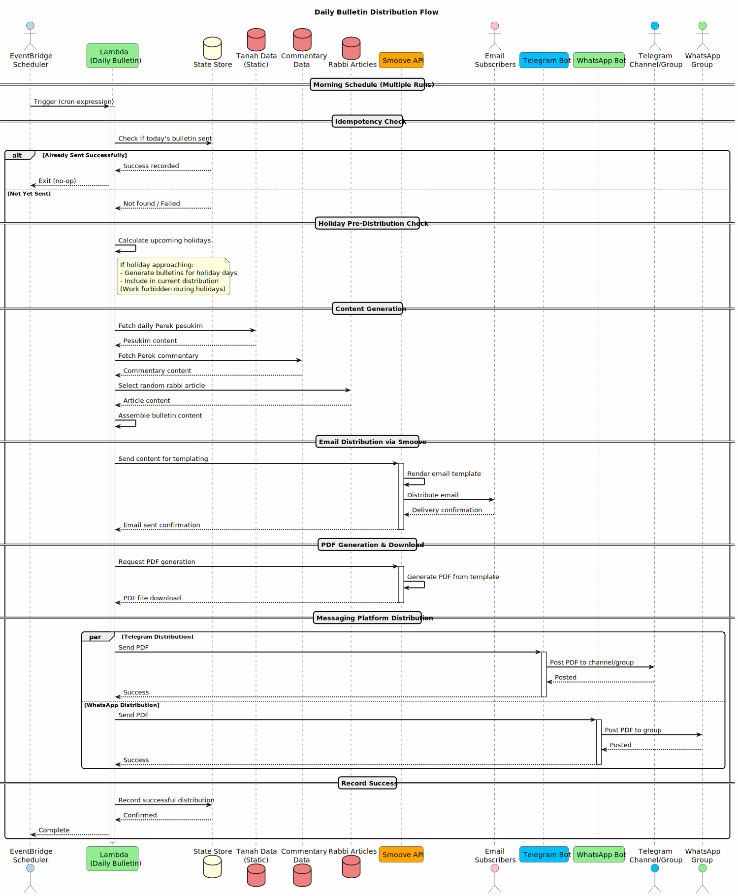

# Daily Bulletin Service

## Overview

The Daily Bulletin is a scheduled service that generates and distributes daily Tanah study content to subscribers via email and messaging platforms (Telegram and WhatsApp).

## Architecture

### Simplfied Flow Diagram
```
┌─────────────────┐
│ Content Sources │
│ - Pesukim       │
│ - Commentary    │
│ - Rabbi Article │
└────────┬────────┘
         │
         ▼
┌─────────────────┐
│   Smoove API    │
│ (Email Service) │
└────────┬────────┘
         │
    ┌────┴────┐
    │         │
    ▼         ▼
┌───────┐ ┌───────────┐
│ Email │ │ PDF Gen   │
│ Send  │ │ & Download│
└───────┘ └─────┬─────┘
                │
         ┌──────┴──────┐
         │             │
         ▼             ▼
   ┌──────────┐  ┌──────────┐
   │ Telegram │  │ WhatsApp │
   │   Bot    │  │   Bot    │
   └────┬─────┘  └────┬─────┘
        │             │
        ▼             ▼
   ┌──────────┐  ┌──────────┐
   │ Channel/ │  │  Group   │
   │  Group   │  │          │
   └──────────┘  └──────────┘
```

### Detailed Sequence Diagram



### Legacy: TypeScript Cron Job

The service was originally implemented as a TypeScript application scheduled via cron jobs on a bare-metal server.

### Target State: AWS Lambda + EventBridge

The service is being migrated to AWS infrastructure:

- **Compute**: AWS Lambda function
- **Scheduling**: Amazon EventBridge Scheduler (formerly CloudWatch Events)
- **Trigger**: EventBridge rule with cron expression for morning runs

## Execution Schedule

The service runs **multiple times during the morning hours** to ensure reliability:

- If a previous run was successful, subsequent runs are skipped (idempotent behavior)
- Success state is tracked to prevent duplicate distributions
- This pattern ensures delivery even if early runs fail due to external service issues

## Content Generation

### Static Content Sources

1. **Tanah Pesukim**: The pesukim of the daily Perek are retrieved from static Tanah data
2. **Commentary**: Commentary for the Perek is included alongside the pesukim
3. **Rabbi Article**: A random article from a rabbi is selected to accompany the daily content

### Holiday Logic

The service implements special handling for Jewish holidays:

- **Pre-Holiday Distribution**: Before holidays begin, the service sends the dailies for those holiday days in advance
- **Reason**: During holidays (Shabbat, Yom Tov), it is forbidden to perform work, including running automated services and sending electronic communications
- **Implementation**: The service calculates upcoming holidays and batches the relevant dailies for pre-distribution

## Integration Points

### Smoove API

[Smoove](https://www.smoove.io/) is the email marketing platform used for:

1. **Email Template Rendering**: The bulletin content is injected into a pre-designed email template
2. **Email Distribution**: Smoove handles sending to the subscriber list
3. **PDF Generation**: Smoove generates a PDF version of the bulletin for messaging platforms

### Telegram Bot

- Receives the downloaded PDF from the service
- Distributes to subscribed Telegram channels and groups
- Enables reach to users who prefer Telegram over email

### WhatsApp Bot

- Receives the downloaded PDF from the service
- Distributes to WhatsApp groups
- Enables reach to users who prefer WhatsApp over email

## Idempotency

The service implements idempotency to handle multiple scheduled runs:

1. On each run, check if today's bulletin was already successfully distributed
2. If successful distribution is recorded, exit early
3. If not, proceed with content generation and distribution
4. Record success state upon completion

## Error Handling

- Multiple morning runs provide retry capability for transient failures
- External service failures (Smoove, Telegram, WhatsApp) are logged
- Partial failures (e.g., email sent but PDF distribution failed) are tracked for manual intervention

## Future Enhancements

- [ ] Migrate from cron-based scheduling to AWS EventBridge Scheduler
- [ ] Implement AWS Lambda function with appropriate IAM roles
- [ ] Add CloudWatch metrics and alarms for monitoring
- [ ] Consider SQS for decoupling distribution to different platforms
