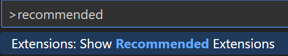
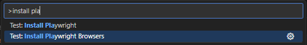
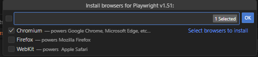
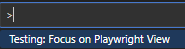
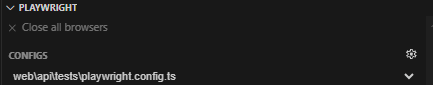
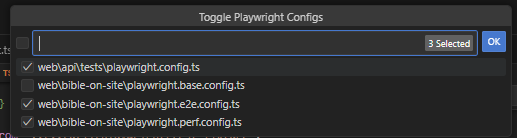

# Setup Development Environment

Any new developer or agent wanting to contribute to the project should follow these steps to set up their development environment.

## Prerequisites

To download necessary tools, clone the repository, and install dependencies, you need network access.

**Note:** You should clone into a path WITHOUT spaces to avoid issues when compiling native modules.

You'll need the following tools:

- [Git](https://git-scm.com)
- [Node.js](https://nodejs.org), version == 24.11.1
  - If using `nvm`, consider updating your default Node installation with `nvm alias default <VERSION>`
- [Python](https://www.python.org/downloads/) == [3.14.0, 3.14.2]
  - Make sure `python` can run from a command line prompt without error
  - Your Python version may not come with all the proper utilities. It is recommended to install the `setuptools` package (`pip install setuptools`); otherwise, you may encounter difficult-to-debug errors.
- [MySQL](https://dev.mysql.com/downloads) == 8.4

For API development, you'll also need:

- [Rust](https://www.rust-lang.org/) == 1.84.1

For App development, you'll also need:

- Android Toolset
  The easiest way to install the following is from the SDK Manager, which is integrated in [Android Studio](https://developer.android.com/studio):
  - SDK Platform - Android 15.0 ("VanillaIceCream") - API Level 35
  - SDK Tools:
    - Android SDK Build-Tools - 35.0.0 + 35.0.1
    - Android SDK Command-line Tools - 17.0
    - Android Emulator - 35.3.11
    - Android Emulator hypervisor driver (installer) - 2.2.0
    - Android SDK Platform-Tools - 35.0.2
- MAUI Toolset
  - `dotnet workload install maui`

For website E2E/performance tests and API testing, you'll also need:

- [Playwright](https://playwright.dev/)
  - `npx playwright install`

## Setting Up the Development Environment

1. Fork the repository (if you want to send PRs)
2. Clone the repository
3. From the project's root, execute `npm i`
4. From `./devops`, execute `npm i`
5. From `./devops`, execute `npm run setup_dev_env`

### Data and MySQL dev database

The development MySQL database is named **tanah-dev**. Populate it with structure and test data from the `data` directory:

```bash
cd data && cargo make mysql-populate-dev
```

For production-like data on demand:

```bash
AWS_PROFILE=AdministratorAccess-250598594267 aws sso login
AWS_PROFILE=AdministratorAccess-250598594267 npx tsx devops/setup-dev-env.mts sync-from-prod
```

This auto-fetches prod DB credentials from SSM and temporarily opens RDS access for your IP. See [Sync from production](../../../data/README.md#sync-from-production-optional) in `data/README.md` for details.

### VS Code

Install recommended extensions:



### Playwright

1. Install Playwright's Chromium:

   

   

2. Navigate to the Playwright view:

   

3. Click the configs configuration button:

   

4. Check the following configs:

   


