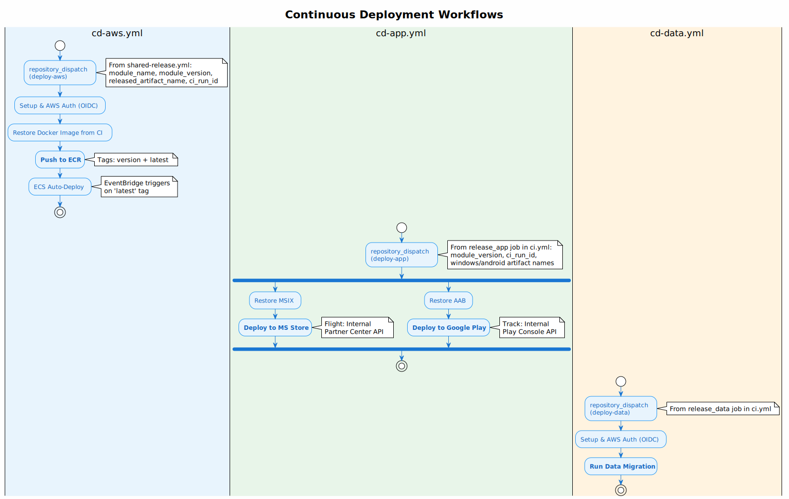

# CD Workflows

All CD workflows are triggered via `repository_dispatch` events from CI after successful builds.

| Workflow | Trigger Event | Purpose |
|----------|---------------|---------|
| [`cd-aws.yml`](../../../../.github/workflows/cd-aws.yml) | `deploy-aws` | Deploy Website/API Docker images to AWS ECR → ECS |
| [`cd-app.yml`](../../../../.github/workflows/cd-app.yml) | `deploy-app` | Deploy mobile/desktop app to Google Play & Microsoft Store |
| [`cd-data.yml`](../../../../.github/workflows/cd-data.yml) | `deploy-data` | Deploy data updates to production database |

## AWS Deployment (`cd-aws.yml`)

Triggered by `shared-release.yml` after Website or API release.

**Flow:**
1. Restore Docker image artifact from CI run
2. Push to AWS ECR with version tag + `latest`
3. ECS auto-deploys via EventBridge (watches `latest` tag)

## App Deployment (`cd-app.yml`)

Triggered by `release_app` job in `ci.yml` after App CI passes.

**Platforms:**

| Platform | Store | Artifact | Track |
|----------|-------|----------|-------|
| Android | Google Play | `.aab` | Internal |
| Windows | Microsoft Store | `.msix` | Flight |

## Data Deployment (`cd-data.yml`)

Triggered by `release_data` job in `ci.yml` after Data CI passes.

**Flow:**
1. Configure AWS credentials (OIDC)
2. Run data migration scripts against production RDS

## Architecture
