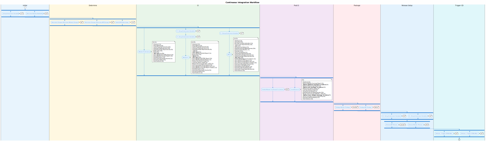

# CI Workflow

| Workflow | Purpose |
|----------|---------|
| [`auto-create-pr`](../../../../.github/workflows/auto-create-pr.yml) | Auto-create PRs when publishing a branch |
| [`ci.yml`](../../../../.github/workflows/ci.yml) | Continuous Integration pipeline |
| [`shared-ci.yml`](../../../../.github/workflows/shared-ci.yml) | Shared CI components |
| [`shared-package.yml`](../../../../.github/workflows/shared-package.yml) | Docker packaging |
| [`shared-release.yml`](../../../../.github/workflows/shared-release.yml) | Release automation |

## Architecture
