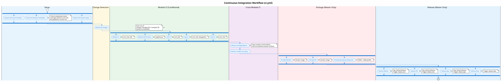

# CI Workflow

| Workflow | Purpose |
|----------|---------|
| [`ci.yml`](../../../../.github/workflows/ci.yml) | Main CI pipeline (test, build, package, release) |
| [`shared-dockerize.yml`](../../../../.github/workflows/shared-dockerize.yml) | Docker image packaging |
| [`app-package.yml`](../../../../.github/workflows/app-package.yml) | App packaging (MSIX, AAB) |
| [`shared-release.yml`](../../../../.github/workflows/shared-release.yml) | Release automation (tag, GitHub Release, trigger CD) |
| [`auto-create-pr`](../../../../.github/workflows/auto-create-pr.yml) | Auto-create PRs when publishing a branch |

## Pipeline Stages

### 1. Setup & Detection
- **Setup Environment Variables**: Extract Playwright versions, set env vars
- **Determine Baseline Availability**: Check if master coverage artifacts exist (cross-workflow)
  - Downloads and re-uploads master artifacts to make them available in current run (website, API, app, bulletin, **admin**)
- **Determine Changes**: One job ([`determine-changes.ts`](../../../../devops/github/ci/determine-changes.ts)) outputs `<module>_module_changed` / `<module>_ci_changed` for every module
- **Build LCOV Docker Image**: Prepare coverage tooling
- **Build Sefaria MongoDB Docker Image**: Publish the Data integration-test MongoDB image to GHCR, tagged by the git tree hash of `data/sefaria/mongodb-docker`, only when that tag is missing

### 2. CI Jobs (Conditional)
Each module CI runs only if: module changed OR CI files changed OR baseline unavailable

| Job | Module | Tests |
|-----|--------|-------|
| Website CI | `web/bible-on-site` | Lint, Unit, E2E |
| Website Performance | `web/bible-on-site` | Lighthouse perf tests |
| API CI | `web/api` | Lint, E2E |
| App CI | `app` | Lint, Unit, Integration |
| Data CI | `data` | Lint, Unit |

### 3. Cross Module CI
- Restores coverage from module CIs (or master baseline if skipped)
- Publishes coverage to Codecov (per-module flags: `website`, `api`, `app`, `bulletin`, `admin`, …)
- Merges and publishes cross-module coverage to Codacy
- Required merge gate ("Check Prerequisites"), failing closed:
  - The detection jobs (`determine_changes`, `determine_baseline_availability`,
    `determine_docker_image_availability`) must succeed — module jobs skip
    silently when they fail, so an unchecked failure would pass untested.
  - Every suite whose own trigger fired (`<module>_module_changed`,
    `<module>_ci_changed`, or a missing coverage/Docker-image baseline) must
    report `success` — a failed, skipped, or cancelled triggered suite still
    blocks the merge. Only a suite whose trigger did not fire may pass untested.
  - `app_ios_ci` (native audio) is the one exception: it runs on PRs only, so
    `skipped` is accepted on other events.

### 4. Packaging (Master Only)
| Job | Output | Purpose |
|-----|--------|---------|
| Package Website | Docker `.tar.gz` | For AWS ECS |
| Package API | Docker `.tar.gz` | For AWS ECS |
| Package App | MSIX + AAB | For stores |

### 5. Release (Master Only)
- Creates Git tag and GitHub Release
- Triggers CD workflow via `repository_dispatch`

## Architecture


## Known Issues & Workarounds

### Reusable Workflow Result Evaluation Bug (GitHub Actions)

**Issue Reference:** [#1065](https://github.com/bible-on-site/bible-on-site/issues/1065)

**Problem:** GitHub Actions has a known issue where jobs depending on reusable workflows may be incorrectly skipped, even when the reusable workflow completes successfully. The `needs.X.result` and `needs.X.outputs.*` values don't propagate reliably in all cases.

**Symptom:** Release jobs (or other downstream jobs) get skipped with no clear reason, even though their upstream packaging jobs ran successfully.

**Workaround:** Use `always()` combined with explicit result checks in the `if` condition:

```yaml
# ❌ DON'T - May cause job to be skipped incorrectly
if: ${{ needs.package_website.outputs.module_version != '' && ... }}

# ✅ DO - Reliable pattern
if: ${{ always() && needs.cross_module_ci.result == 'success' && needs.package_website.result == 'success' && needs.package_website.outputs.module_version != '' && ... }}
```

**Rule: When Adding New Jobs That Depend on Reusable Workflows:**

1. **Always use `always()`** at the start of the `if` condition
2. **Explicitly check `.result == 'success'`** for ALL upstream reusable workflow jobs
3. **Then add your business logic conditions** (outputs, branch checks, etc.)

**Example - Adding a new release job:**
```yaml
release_new_module:
  name: Release New Module
  needs: [setup_env, determine_changes, cross_module_ci, package_new_module]
  # Note: Using always() + output check as a workaround for reusable workflow result evaluation issues (see #1065)
  # Also verify cross_module_ci and package_new_module passed to ensure quality gate
  if: ${{ always() && needs.cross_module_ci.result == 'success' && needs.package_new_module.result == 'success' && needs.package_new_module.outputs.module_version != '' && needs.determine_changes.outputs.new_module_module_changed == 'true' && needs.setup_env.outputs.is_master_branch == 'true' && github.event_name == 'push' }}
```

**Affected Jobs:** `release_website`, `release_api`, `release_app`

### Draft release lookup and recovery

GitHub's release-by-tag endpoint returns published releases. For an interrupted
draft, use the authenticated, paginated release listing to find the exact tag;
authorization and transport failures must stop recovery. After the release action
uploads assets, use its numeric release ID to read and publish that draft only
after local files match every expected uploaded asset's size and digest.

Rerunning the same source resumes its draft. A published release retains its
original artifacts, source CI run and attempt. A different source using that
version must take the normal collision bump; never move its tag or overwrite its
published assets.

If an older workflow still uses the published-only endpoint and cannot resume its
draft, verify the original passing source quality, tag/source/attempt metadata,
Actions archive IDs and hashes, and all release asset bytes before publishing by
ID. Then rerun only the failed release jobs: their published-release path replays
the original payload and lets the normal CD guards and queued master version
publisher finish recovery.

See [GitHub's release API](https://docs.github.com/en/rest/releases/releases) and
validate changes with `npm run test:version` in `devops`.

TestFlight delivery reads the app identity, marketing version, and build number
from the published IPA and checks that exact iOS build through Apple's API.
An existing valid build resumes distribution without another binary upload.
Processing builds are polled; rejected builds and API errors fail the delivery.
If an earlier recorded delivery exists and Apple cannot confirm its build, a
retry does not upload again. Keep the original uploader error visible and use
the read-only **Inspect TestFlight build** workflow to inspect the published
release before recovery. The normal source, quality, freshness, and deployment
ledger guards still apply to every production write.

Upload verification and beta distribution are separate steps. Distribution
uses both the exact app version and build number; an external submission limit
still leaves the verified upload successful with a visible warning (#1183).
Independent distribution workflows remain tracked in
[issue #1183](https://github.com/bible-on-site/bible-on-site/issues/1183).
See [Apple's build query](https://developer.apple.com/documentation/appstoreconnectapi/get-v1-builds)
and [Fastlane's upload/distribution options](https://docs.fastlane.tools/actions/pilot/).
