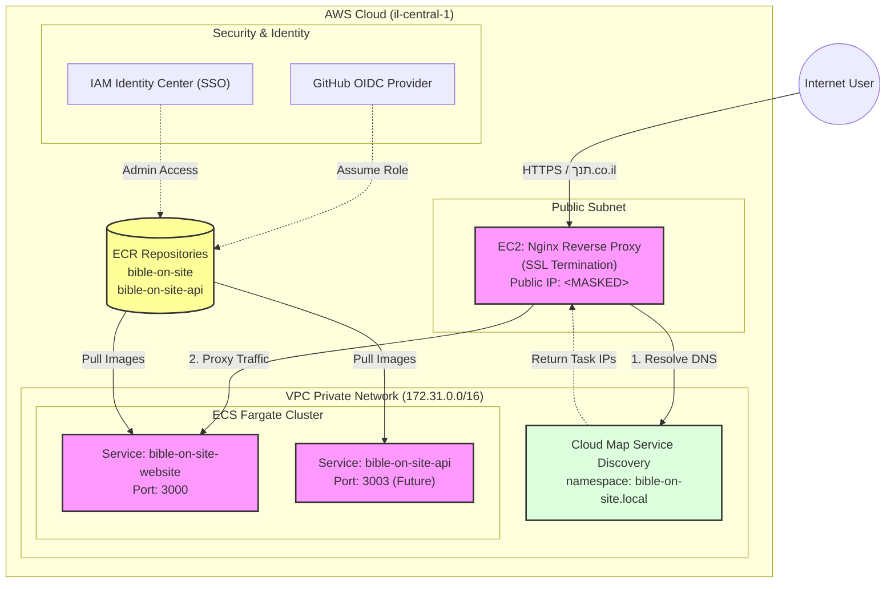

# AWS Architecture

The following diagram illustrates the high-level architecture of the Bible On Site infrastructure on AWS.

## Architecture Diagram

## Component Details

### 1. Entry Point (EC2 Nginx)
- **Role**: Reverse Proxy & SSL Termination.
- **Configuration**: Manages certificates for `תנך.co.il` and `תנך.com`.
- **Routing**: Uses the VPC DNS resolver (`172.31.0.2`) to resolve internal ECS service names via Cloud Map.

### 2. Compute (ECS Fargate)
- **Cluster**: `bible-on-site-cluster`
- **Services**: Runs the application containers (Next.js website, Rust API).
- **Networking**: Tasks run in private subnets (logically) or public subnets with public IPs but restricted security groups.

### 3. Service Discovery (Cloud Map)
- **Namespace**: `bible-on-site.local`
- **Function**: Automatically registers ECS task IPs so Nginx can route to them dynamically without a Load Balancer.

### 4. Storage (ECR)
- Stores the Docker images for the application and API.
- Images are tagged with version numbers and `latest`.
